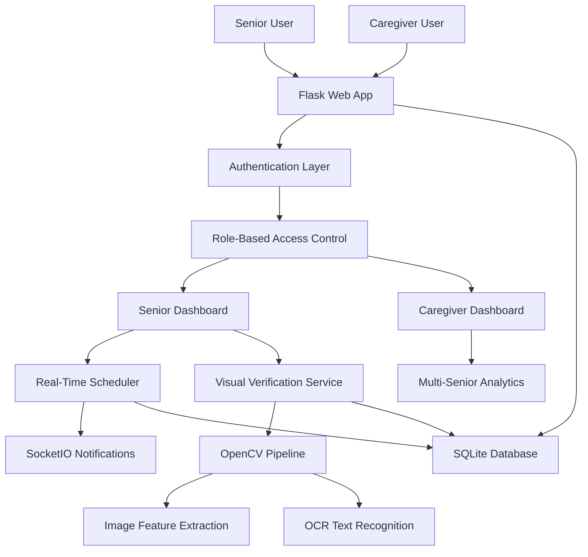

# 💊 MedGuardian - AI-Powered Medication Management System

[](https://python.org)
[](https://flask.palletsprojects.com)
[](https://opencv.org)
[](LICENSE)

> **A production-ready healthcare platform for senior medication adherence monitoring with computer vision verification, real-time reminders, and caregiver dashboards.**

---

## 🌟 Key Features

### For Senior Citizens
- **🔔 Smart Reminders**: Real-time notifications via WebSocket with audio alerts
- **📸 Visual Verification**: OpenCV-based medication bottle recognition
- **👴 Senior-Friendly UI**: Large text, high contrast, accessibility-focused design
- **⏰ Flexible Scheduling**: Custom times or preset periods (Morning/Afternoon/Evening/Night)
- **📊 Compliance Tracking**: Visual progress charts and medication history
- **🎤 Voice Commands**: Hands-free medication confirmation

### For Caregivers
- **👨‍⚕️ Multi-Senior Dashboard**: Monitor multiple seniors from one interface
- **📈 Real-Time Analytics**: Compliance rates, missed doses, trends
- **🚨 Instant Alerts**: Get notified when seniors miss medications
- **🔗 Secure Relationships**: Permission-based access control
- **📋 Detailed Reports**: Export medication logs and compliance data

### Technical Highlights
- **🤖 Computer Vision**: Custom OpenCV pipeline for medication verification
- **🔬 OCR Integration**: Tesseract-powered label text extraction
- **⚡ Real-Time Features**: SocketIO for instant notifications
- **🔐 Security**: CSRF protection, password hashing, role-based access
- **📱 Responsive**: Mobile-friendly Bootstrap design
- **🧪 Validated**: Pydantic schema validation on all inputs

---

## 📸 Screenshots

### Senior Dashboard

*Clean, large-text interface with upcoming medications and compliance tracking*

### Caregiver Dashboard

*Professional monitoring interface with multi-senior analytics*

### Visual Verification

*OpenCV-powered medication bottle recognition with similarity scoring*

---

## 🏗️ Architecture



### Tech Stack

**Backend**
- **Flask 2.3+**: Web framework
- **SQLAlchemy**: ORM and database management
- **Flask-SocketIO**: Real-time WebSocket communication
- **APScheduler**: Background job scheduling
- **Pydantic**: Request validation

**Computer Vision**
- **OpenCV 4.8+**: Image processing and feature extraction
- **Tesseract OCR**: Label text recognition
- **NumPy**: Numerical computations

**Frontend**
- **Bootstrap 5**: Responsive UI framework
- **JavaScript (ES6+)**: Client-side logic
- **Chart.js**: Data visualization

**Security**
- **Flask-Login**: Session management
- **Flask-WTF**: CSRF protection
- **Werkzeug**: Password hashing (bcrypt)

---

## 🚀 Quick Start

### Prerequisites
- Python 3.8 or higher
- pip (Python package manager)
- Tesseract OCR (optional, for label reading)

### Installation

1. **Clone the repository**
```bash
git clone https://github.com/yourusername/medguardian.git
cd medguardian
```

2. **Create virtual environment**
```bash
python -m venv venv

# Windows
venv\\Scripts\\activate

# Linux/Mac
source venv/bin/activate
```

3. **Install dependencies**
```bash
pip install -r requirements.txt
```

4. **Install Tesseract (Optional but recommended)**

**Windows:**
Download from: https://github.com/UB-Mannheim/tesseract/wiki
Add to PATH: `C:\\Program Files\\Tesseract-OCR`

**Linux:**
```bash
sudo apt-get install tesseract-ocr
```

**Mac:**
```bash
brew install tesseract
```

5. **Configure environment variables**
```bash
cp .env.example .env
# Edit .env with your settings
```

6. **Initialize database**
```bash
python
>>> from app import create_app, db
>>> app = create_app()
>>> with app.app_context():
...     db.create_all()
>>> exit()
```

7. **Run the application**
```bash
python run.py
```

8. **Access the application**
Open your browser to: `http://localhost:5001`

---

## 📖 Usage Guide

### For Seniors

1. **Register/Login**
   - Create account with username, email, password
   - Select "Senior Citizen" role

2. **Add Medications**
   - Click "Add Medication" button
   - Enter name, dosage, frequency
   - Set reminder times (Morning, Afternoon, Evening, Night, or Custom)
   - Optionally capture reference image for verification

3. **Receive Reminders**
   - Get browser notifications when its time
   - Click "I've Taken It" to mark as taken
   - Option to verify with camera

4. **Visual Verification**
   - Allow camera access
   - Show medication bottle to camera
   - System compares with reference image
   - Get instant verification result

### For Caregivers

1. **Register as Caregiver**
   - Create account with "Caregiver" role

2. **Add Seniors**
   - Navigate to "Add Senior"
   - Enter senior's username
   - Establish relationship

3. **Monitor Compliance**
   - View all assigned seniors on dashboard
   - See real-time compliance rates
   - Check today's medication status
   - View missed doses

4. **Receive Alerts**
   - Get notified when seniors miss medications
   - View detailed logs and history

---

## 🔬 Computer Vision System

### How It Works

1. **Reference Image Capture**
   - Senior photographs medication bottle once
   - System extracts visual features:
     - **Color Histogram** (HSV color space)
     - **Shape Features** (aspect ratio, contours)
     - **Text Regions** (for OCR)

2. **Real-Time Verification**
   - When taking medication, senior shows bottle to camera
   - System compares current image with reference
   - **Similarity Score**: 0-100% match

3. **Multi-Modal Comparison**
   - **70% Weight**: Color histogram correlation
   - **30% Weight**: Shape matching
   - **Bonus**: OCR text matching for label verification

4. **Threshold**: 75% similarity required for verification

### Technical Details

```python
# Color Histogram (HSV)
hist_score = cv2.compareHist(hist1, hist2, cv2.HISTCMP_CORREL)

# Shape Matching
shape_score = compare_contours(contour1, contour2)

# Final Score
similarity = (hist_score * 0.7) + (shape_score * 0.3)
```

---

## 🔐 Security Features

- ✅ **Password Hashing**: Bcrypt with salt
- ✅ **CSRF Protection**: Token-based form protection
- ✅ **Role-Based Access**: Seniors/Caregivers/Admin permissions
- ✅ **Session Management**: Secure Flask-Login sessions
- ✅ **Input Validation**: Pydantic schema validation
- ✅ **SQL Injection Prevention**: SQLAlchemy ORM
- ✅ **File Upload Safety**: Image validation and size limits

---

## 📊 API Documentation

### Authentication
```http
POST /auth/register
POST /auth/login
GET /auth/logout
```

### Medications
```http
GET /api/v1/medications
GET /api/v1/medications/:id
POST /api/v1/medications
PUT /api/v1/medications/:id
DELETE /api/v1/medications/:id
POST /api/v1/medications/quick-test
```

### Verification
```http
POST /api/v1/verify
GET /medication/verification
POST /medication/verify-realtime
```

### Relationships
```http
POST /caregiver/add-senior
DELETE /caregiver/remove-senior/:id
GET /caregiver/senior/:id
```

Full API documentation: [docs/API.md](docs/API.md)

---

## 🧪 Testing

### Run Tests
```bash
pytest tests/ -v
```

### Test Coverage
```bash
pytest --cov=app tests/
```

### Manual Testing
1. Use Quick Test feature: `/quick-test`
2. Creates test medication due in 2 minutes
3. Verify reminder appears
4. Test camera verification flow

---

## 🚢 Deployment

### Production Checklist

- [ ] Set `FLASK_ENV=production` in `.env`
- [ ] Use PostgreSQL instead of SQLite
- [ ] Set strong `SECRET_KEY`
- [ ] Enable HTTPS/SSL
- [ ] Set up Redis for SocketIO scaling
- [ ] Configure email server for notifications
- [ ] Set up monitoring (Sentry, etc.)
- [ ] Configure backup strategy

### Deploy to Render/Railway/Heroku

1. Create `Procfile`:
```
web: gunicorn -k geventwebsocket.gunicorn.workers.GeventWebSocketWorker -w 1 wsgi:app
```

2. Add `runtime.txt`:
```
python-3.10.12
```

3. Set environment variables on platform
4. Deploy!

---

## 🤝 Contributing

We welcome contributions! Please see [CONTRIBUTING.md](CONTRIBUTING.md) for guidelines.

### Development Setup
1. Fork the repository
2. Create feature branch: `git checkout -b feature/amazing-feature`
3. Commit changes: `git commit -m 'Add amazing feature'`
4. Push to branch: `git push origin feature/amazing-feature`
5. Open Pull Request

---

## 📄 License

This project is licensed under the MIT License - see [LICENSE](LICENSE) file.

---

## 👥 Authors

**Adithya Krishnan**
- GitHub: [@adithyakrish0](https://github.com/adithyakrish0)
- Email: your.email@example.com

---

## 🙏 Acknowledgments

- Bootstrap team for UI framework
- OpenCV community for computer vision tools
- Flask and SQLAlchemy teams
- All contributors and testers

---

## 📞 Support

For issues and questions:
- **Issues**: [GitHub Issues](https://github.com/yourusername/medguardian/issues)
- **Discussions**: [GitHub Discussions](https://github.com/yourusername/medguardian/discussions)
- **Email**: support@medguardian.com

---

## 🗺️ Roadmap

### Version 2.0 (Next Release)
- [ ] Mobile app (React Native)
- [ ] Advanced ML models for pill recognition
- [ ] Multi-language support
- [ ] Voice assistant integration
- [ ] Pharmacy integration API
- [ ] Insurance claim automation

---

**Made with ❤️ for improving senior healthcare**
